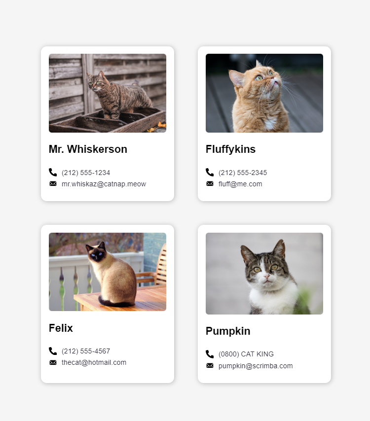
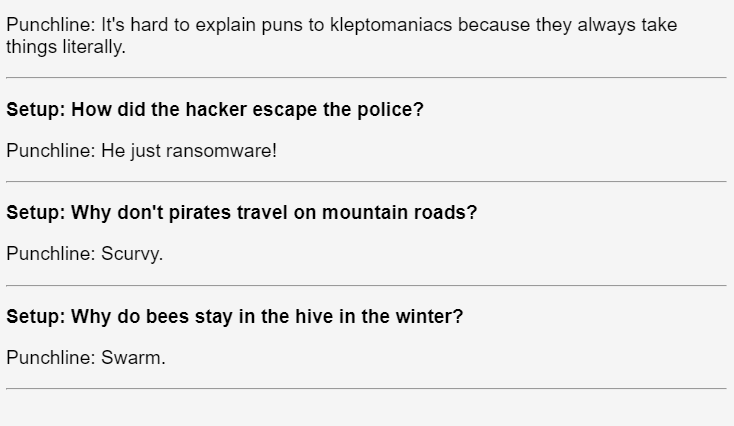

All of my pratice challenge in reactjs:) 
-----------------------------------------------------------------------------------
contact-component: 
Practicing passing data with props by writing a small contact page with mr.'cats"
------------------------------------------------------------------------------------

------------------------------------------------------------------------------------
Joke: 
Practicing passing data with props by writing a small 'joke page' with setup-punchline quotes
